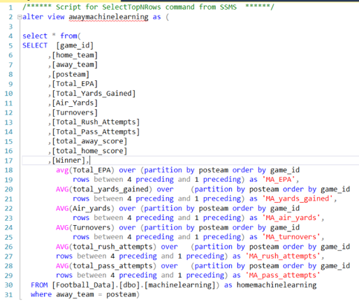
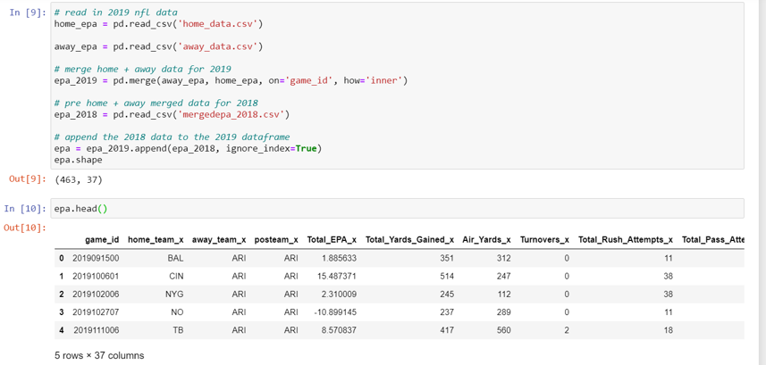
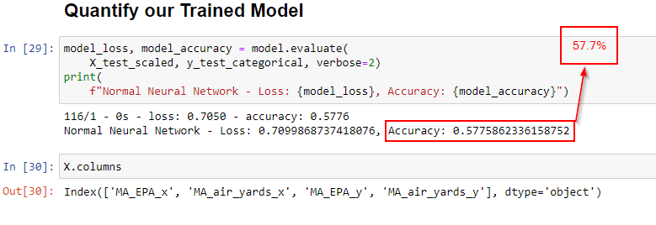
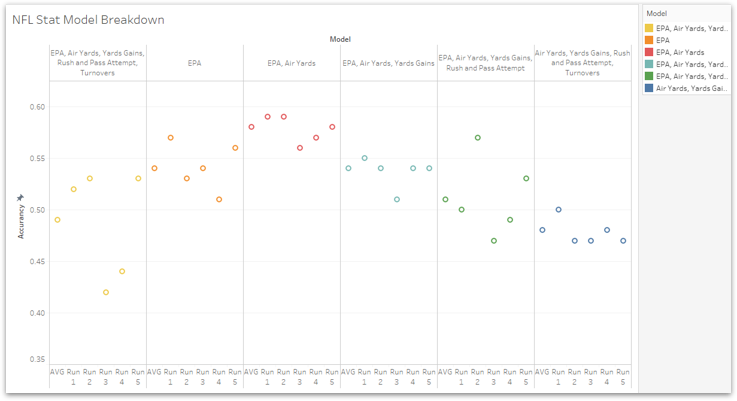
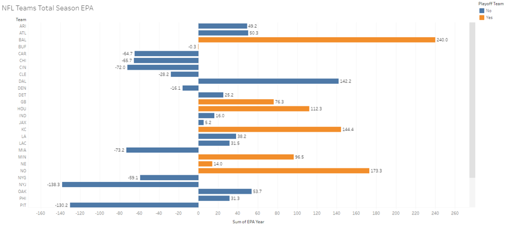
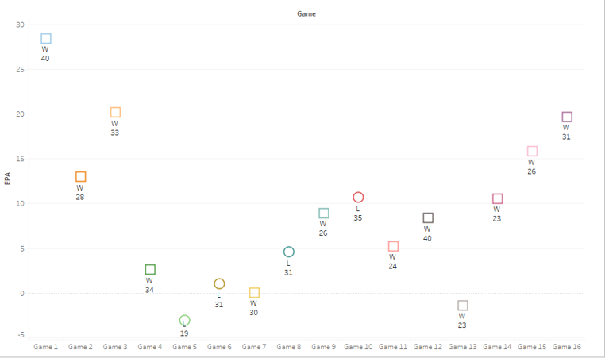
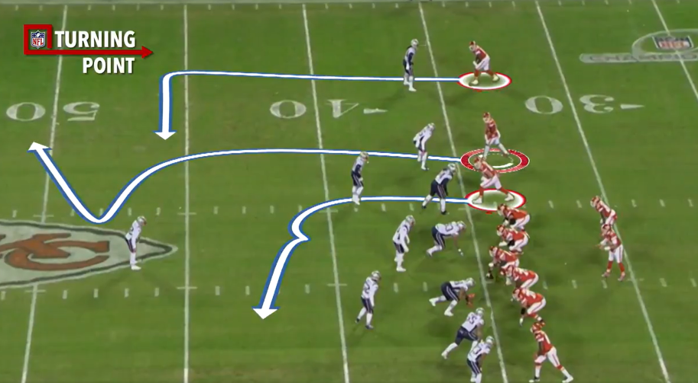

# NFL EPA Project

## Objective - Field (Goals)
* Can we train a model to intake data points from previous season NFL team stats?
* Based on the stats, how accurately can it predict the winner?
* Can we run multiple models selecting data we think should be more valuable to prediction.
* Can we used the train model to predict future games?
* Can we incorporate betting indicators on these results?

## Definitions - The Playbook
* EPA - Expected Points Added
* The value of a football play has traditionally been measured in yards gained.  But this is now considered a flawed measurement because not all yards are equal. 
* A 4-yard gain on 3rd down and 3 is much more valuable than a 4-yard gain on 3rd and 8. Any measure of success must consider the down and distance situation.
* Field position is also an important consideration. Yards gained near the goal line are tougher to come by and are more valuable than yards gained at midfield. Yards lost near one’s own goal line can be more costly as well.
* **Not All Plays Are Created Equal** - EPA is a method of assigning relational value to these different type of plays.

## Data and Munging - The Playing Field
* Original dataset is listed by play, grouped by game_id
* Needed to remove non-plays (time-outs, penalties)
* Narrowed down to two lines per game_id for each team. Separated by home and away
* Creating a moving average of 3 previous games to populate in the rows of data. 

*SQL*

*Merging and appending in Pandas*

## Model - Trusting The Process
* Used a Deep Learning Sequential model with a dense layers
** Dense Layer = a regular layer of neurons in a neural network. Each neuron receives input from all the neurons in the previous layer, thus densely connected.
* Model used MA over last 3 games to make prediction on outcome of the game
* Data Points - EPA, Total Yards, Air Yards, Turnovers, Rush Attempts, Pass Attempts
* To predict wins - look at a rolling 3 game average of stats per Game ID, then compare to a second team, run the 200 epochs, then make its prediction and finally look at the results to see if it was correct.

## Most Effective Model - EPA, Air Yards
200 epochs - 5 Runs: 
* Run 1: 58.6%
* Run 2: 58.6%
* Run 3: 56%
* Run 4: 56.8%
* Run 5: 57.7%
* AVG: 58%

## Models Ran
*We ran 6 models a total of 5 times to determine accuracy. The advanced stats of EPA and Air Yards produced the highest accuracy.

## Model Outcomes and Acknowledgements
* What are our insights from the various model runs?  All data was too much noise?  
* Turnovers are too unpredictable
* Models with EPA provided a higher accuracy result
* We have no ‘soft factors’ accounted for such as weather, home field advantage, etc.

## Correlation Between Team EPA and Making the Playoffs

## Chiefs EPA By Game and Points Scored

## Lessons Learned - Overtime
Challenges:
* Began with different data than what we would use to predict games
* Started out only using 2019 data but then incorporated 2018 to increase sample size

Opportunities:
* Coaches and General Managers
* Fantasy Sports (Isolate EPA by Player)
* Gambling Applications

## Conclusion
Publicly available data can help us better commentate, project, and analyze the game of football. It can be useful when making decisions in fantasy sports or when wagering on games, but it doesn't replace X's and O's:

